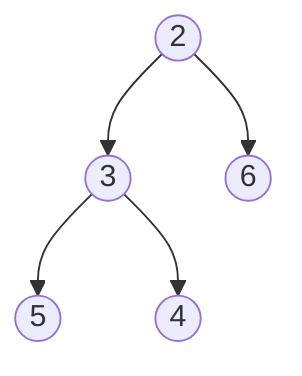
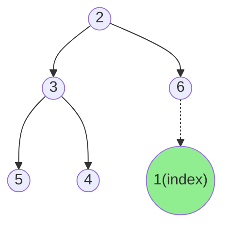
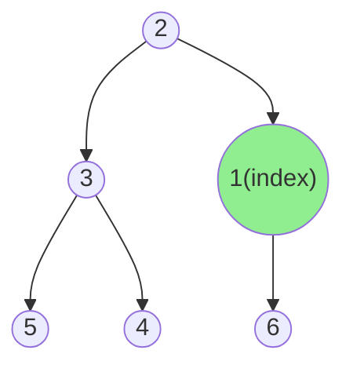
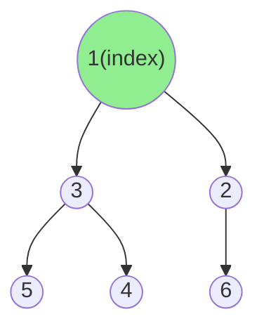
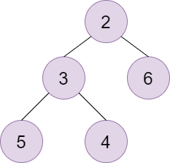
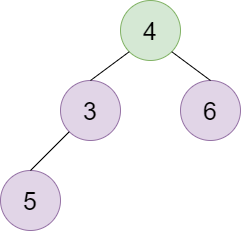
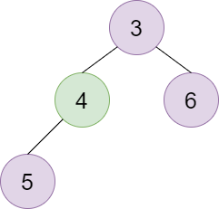

# 堆排序&优先队列
___
目录
[toc]
## 堆排序
___
### 堆排序原理
> **堆是一颗具有特定性质的二叉树。**
> **堆的性质**：
>
> 1. 堆中所有结点的值必须大于或者等于(或小于等于)其孩子结点的值；
> 2. 堆是一颗完全二叉树。
>
> **二叉堆**：
> 在二叉堆中，每个结点最多有两个孩子结点，二叉堆一般分为 *二叉最小堆*  和 *二叉最大堆*
> <br>


### 堆排序函数

下面以最小堆为例列举实现二叉堆需要的函数

#### 预备工作
```c++
//头文件
#include <stdio.h>

#define MAXN 1001

//自定义元素类型
typedef int ElemType;

//最小堆的顺序表
int SizeOfHeap = 0;
ElemType Heap[MAXN];

```

#### 插入堆函数

先将插入的结点放在二叉树的末尾，然后根据优先级与其双亲结点进行比较，如果优先级高于双亲结点则将他们交换，直到重新形成二叉堆。

```c++
void push(ElemType x){
    //首先插入到最后一个位置
    int index = ++SizeOfHeap;
    //向上调整
    while(index > 1){  //只有i>1时才有父节点
        int IndexOfParent = index / 2;
        if(Heap[IndexOfParent] <= x){
            break;
        }
        Heap[index] = Heap[IndexOfParent];
        index = IndexOfParent;
    }
    Heap[index] = x;
}
```
**图解**

<div align="center">

<br>
<br>
<br>




<center><font size=4>初始堆</font></center>

<br>
<br>



<center><font size=4>插入新结点并向上调整</font></center>
<br>
<br>


<center><font size=4>继续向上调整</font></center>
<br>
<br>


<center><font size=4>插入完成</font></center>

<br>
<br>

</div>

#### 删除最值函数

先临时保存一份最值，然后将最后一个结点放到根节点，依次向下移动结点直到二叉堆平衡。

```c++
//删除操作
ElemType pop(){
    //获取最值
    ElemType result = Heap[1];
    //相当于将最后一个结点放到根节点
    ElemType x = Heap[SizeOfHeap];
    int index = 1;
    //一定要有子节点
    while(2 * index <= SizeOfHeap){
        int LSonIndex = 2 * index;
        int RSonIndex = 2 * index + 1;
        //比较儿子结点的最值
        int MinIndex = LSonIndex;
        if(RSonIndex <= SizeOfHeap && Heap[RSonIndex] < Heap[MinIndex]){
            MinIndex = RSonIndex;
        }
        //如果没有颠倒就结束
        if(Heap[MinIndex] >= x){
            break;
        }
        Heap[index] = Heap[MinIndex];
        index = MinIndex;
    }
    Heap[index] = x;
    SizeOfHeap--;
    return result;
}
```

**图解**



<center>初始堆</center>

<br>

<br>



<center>将尾结点移动到根节点</center>

<br>

<br>



<center>平衡二叉堆</center>

<br>

<br>

#### 获取堆顶元素

```c++
//获取堆顶元素
ElemType GetTop(){
    return Heap[0];
}
```

<br>

<br>

#### 创建空堆

使用一个数组来创建空堆

```c++
void Build_Heap(int data[],int n){
    //创建一个空堆
    SizeOfHeap = 0;
    for(int i = 0;i < n;i++){
        push(data[i]);
    }
}
```


## 优先队列

### 原理

> 优先队列也是一种队列，不过优先队列的出队顺序是按照优先级来的
>
> 如果最小的键值元素拥有最高的优先级，那么这种优先队列叫做*升序优先队列*, 相反，如果最大键值元素具有最高的优先级，这种优先队列叫做*降序优先队列*。
>
> 优先队列的基本操作类似于二叉堆的基本操作。


### 优先队列的应用

- 数据压缩：Huffman 算法
- 最短路径：Dijkstra算法
- 最小生成树：Prim算法
- 事件驱动仿真：顾客排队算法
- 选择问题：查找第k个最小元素
- ... ...


### 优先队列的实现比较

| 实现           | 插入          | 删除          | 寻找最小值    |
| -------------- | ------------- | ------------- | ------------- |
| 无序数组       | 1             | n             | n             |
| 无序链表       | 1             | n             | n             |
| 有序数组       | n             | 1             | 1             |
| 有序链表       | n             | 1             | 1             |
| 二叉搜索树     | log n（平均） | log n（平均） | log n（平均） |
| 平衡二叉搜索树 | log n         | log n         | log n         |
| 二叉堆         | log n         | log n         | 1             |


___

## 例题

